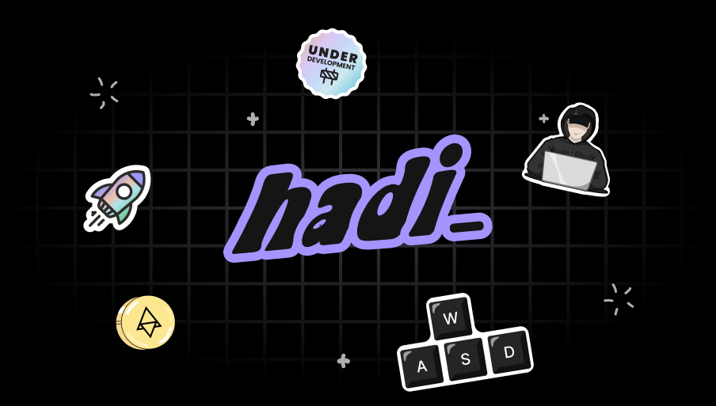

# Hi there!

  I'm a french developer enthusiastic about bash, golang, infosec & blockchains ☁️ 
   I deeply value open-source projects & actively seek ways to contribute to the community.
   I'm particularly interested in emerging technologies such as blockchains and cryptocurrency. 
   I enjoy the challenge of reimagining existing apps & scripts in my own unique way.
   By creating these projects from scratch, I can ensure complete control over every aspect of their design and functionality.

  
  

  

---

 Portfolio: <a href="https://anotherhadi.com/">anotherhadi.com</a>
 Nostr NPub: [npub1s7zlgcn5wlc8yyh609xqh79055fapq5lelsmsng2s38dn002n9vsc5dkcj](https://iris.to/npub1s7zlgcn5wlc8yyh609xqh79055fapq5lelsmsng2s38dn002n9vsc5dkcj)
 Lightning Address: [hadi@anotherhadi.com](lightning:hadi@anotherhadi.com)
 X: [@AnotherHadi](https://x.com/AnotherHadi)
 

  

